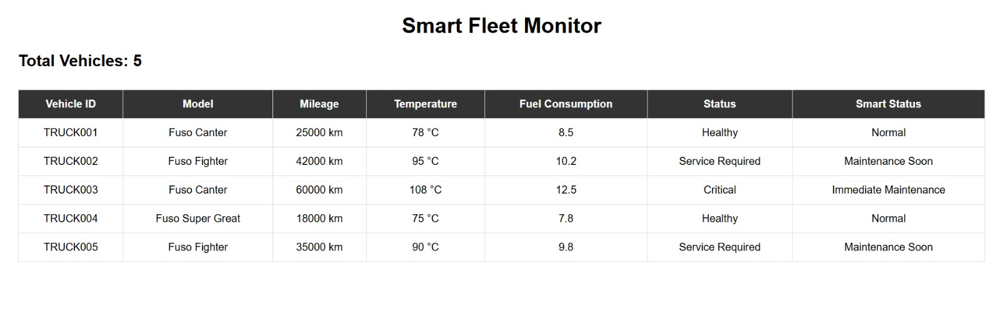

# 🚗 Smart Fleet Monitor
Smart Fleet Monitor is a web-based fleet monitoring application built with Python and Flask that allows users to monitor vehicle information, performance metrics, and operational status through an interactive dashboard.

## 🎯 Problem Statement
Managing information for multiple vehicles can be challenging when vehicle data such as mileage, temperature, fuel consumption, and operational status needs to be monitored efficiently. A centralized monitoring system can help users access vehicle information in one place and make it easier to understand the current condition of the fleet.

## 💡 Solution
Smart Fleet Monitor provides a centralized web dashboard for viewing and monitoring vehicle data. The Flask backend processes vehicle information and exposes it through an API, while the frontend uses JavaScript to retrieve the data dynamically and display it through an easy-to-use dashboard.

## ✨ Features
- 🚗 Vehicle information monitoring
- 📊 Interactive fleet dashboard
- 🌡️ Temperature monitoring
- 🛣️ Mileage tracking
- ⛽ Fuel consumption monitoring
- 📋 Vehicle status display
- 🔗 Flask REST API
- ⚡ Dynamic data loading using JavaScript
- 🤝 GitHub-based collaborative development

## 🛠️ Tech Stack
### Frontend
- HTML
- CSS
- JavaScript
### Backend
- Python
- Flask
### Data
- CSV
### Development & Collaboration
- Git
- GitHub
- Visual Studio Code

## 🖥️ Project Preview
                   

## Architecture
                    Vehicle Dataset
                    vehicles.csv
                         │
                         ▼
                   Flask Backend
                      app.py
                         │
                         ▼
                   REST API
                 /api/vehicles
                         │
                         ▼
                  JavaScript
                  script.js
                         │
                         ▼
                 Web Dashboard
                   index.html
                         │
                         ▼
                     CSS
                  style.css

## 📂 Project Structure
smart-fleet-monitor/
│
├── data/
│   └── vehicles.csv
│
├── static/
│   ├── style.css
│   └── script.js
│
├── templates/
│   └── index.html
│
├── app.py
├── requirements.txt
└── README.md

## ⚙️ How It Works
1. Vehicle information is stored in `vehicles.csv`.
2. The Flask backend reads the vehicle data.
3. Flask exposes the vehicle information through the `/api/vehicles` endpoint.
4. The frontend JavaScript sends a request to the API.
5. The API returns the vehicle data in JSON format.
6. JavaScript dynamically displays the information on the dashboard.

## 🚀 Installation
### 1. Clone the repository
git clone https://github.com/Brindhaa-S-M/smart-fleet-monitor.git
### 2. Navigate to the project
cd smart-fleet-monitor
### 3. Create a virtual environment
python -m venv venv
### 4. Activate the virtual environment
Windows:
venv\Scripts\activate
### 5. Install dependencies
pip install -r requirements.txt

## ▶️ Run the Application
python app.py
Open your browser and go to:
http://127.0.0.1:5000

## 👥 Team & Contributions
### My Contribution
- Developed and integrated the Flask backend.
- Worked with the vehicle dataset.
- Implemented the vehicle API.
- Integrated the frontend with the backend API.
- Worked with Git and GitHub for collaborative development.
### Team Member Contribution
- Developed the frontend components.
- Worked on HTML/CSS/JavaScript.
- Contributed to dashboard design and testing.
  
"We used GitHub branches to separate development work and collaborated on integrating the frontend and backend."
